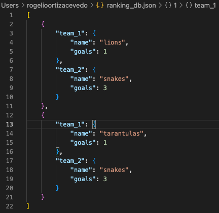
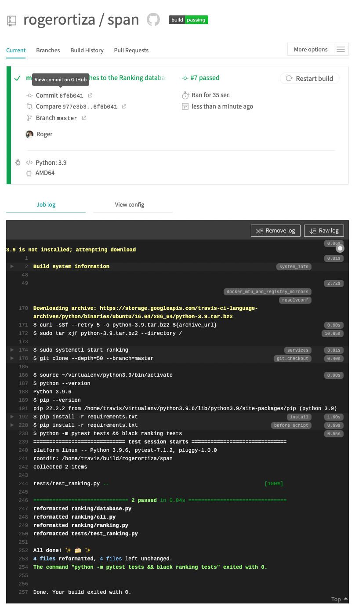
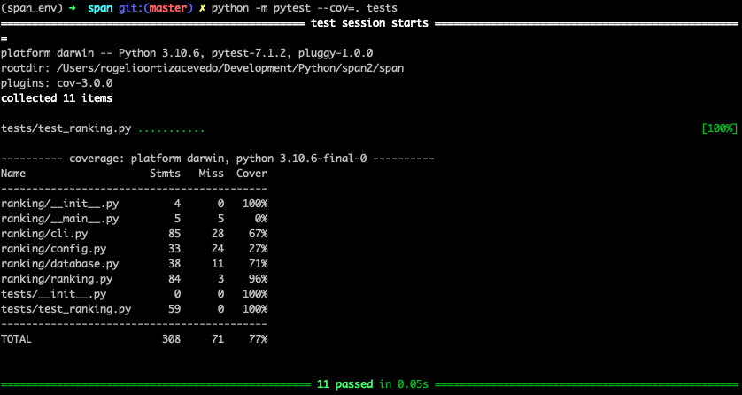
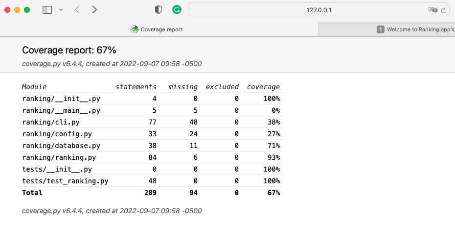
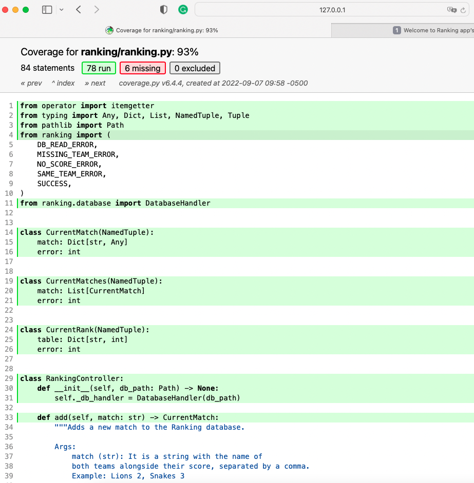

# Ranking Table for a League.

## Installation.
First, clone the project and then run the following command in your terminal.

`bash entrypoint.sh`

>This command will install and start the CLI application. Also, it will create the database for you, so you don't need to run the init command to start adding matches to the database.
## Usage.
To start, make sure you are in the virtual enviroment. 

`(span_env) ➜  span git:(master) ✗`

Then you can find the following global options executing this command:

`python -m ranking help`

**-v or --version:** shows the current version and exits the application. 

**--help:** shows the global help message for the entire application.

The ranking application will provide commands to initialize the app, add and show matches played and clean the database:

+ **init** -> Initializes the Ranking CLI application. You can pass an argument to indicate where you would like to create the database. This argument is optional.
+ **add MATCH** -> Adds a new to match to the database, this command requires an argument which is the **match** (string). This argument is mandatory. 
+ **all_matches** -> Shows a list with all the played matches registered in the database.
+ **table_rank** -> Shows the table rank of the league.
+ **clean** -> Removes all the matches by clearing the database.
### Examples:
To initiate the application with database argument:

`python -m ranking init --db_path=./ranking.json`

To add macth into the database. You can add matches one by one:

`python -m ranking add 'Lions 3, Sneaks 3'`

To see all the matches:

`python -m ranking all_matches`

To see the table rank;

`python -m ranking table_rank`

To clean the database:

`python -m ranking clean`

## Project Layout
- docs/ -> Contains the CLI app documentation.
- ranking/ -> Contains the CLI app code.
- tests/ -> Contains the unittests
- travis.yml -> Contains the Travis' configuration for CI.
- entrypoint.sh -> Is a script to install the CLI application.
- README.md -> This file. :)
- requirements.txt -> Contains a list of all the packages needed to install the CLI app.

>Inside the ranking folder you can find the following files:

| File          |  Desciption                              |
|---------------|------------------------------------------|
| __init__.py   | Enables ranking/ to be a Python package  |
| __main__.py   | Provides an entry-point to run the app from the package using the python -m ranking command |
| cli.py        | Provides the Typer command-line interface for the application.  |
| config.py     | Contains code to handle the application's configuration file  |
| database.py   | Contains code to handle the application's ranking database  |
| ranking.py    | Provides code and logic to connect the CLI app with the database.  |

>Inside the tests folder you can find the following files.

| File           |  Desciption                              |
|----------------|------------------------------------------|
| __init__.py    | To indicate this is a Python package  |
| test_rankin.py | Contains all the unittest |

## Database
For this project, it was implemented a .json file to persist all the matches. So, in this way, we can read and write matches.

Each record is made up of two teams with their names and goals.

## Continuous Integration
Travis was implemented to maintain good quality in the project. Every time a new change was pushed to the repository, a new build was deployed to confirm that everything was working correctly by running unit tests automatically.

## How to?

### How to create the code documentation?
Please, move to this path **docs/** in your terminal and run the following command.

`make html`

Then, you will see a new folder inside the **docs/** named build and under this new folder you will find the html folder, search the index.html and open it with you favorite browser. You will see something like this:

### How to run the coverage?
In your terminal, make sure you are in the root path then run the following command:

`python -m pytest --cov=. tests`

You should see the following output:

If you want to see just a report:

`python -m coverage report`

But if you want to see more details, you can create an HTML report where you can find a lot more information and see what code lines are precisely covered by the unit tests.

`python -m coverage html`

Afer run this command you will see a new folder in the root path named **htlmcov**. Under this new folder there is a index.html file, open it with your browser and you will see the coverage report in html format.

You can see the coverage file by file and realize what code lines the unittests are covering.

For more information please feel free to contact me:

Email: rogerortiz4@gmail.com

LinkedIn: https://www.linkedin.com/in/rogelio-ortiz-2a556040/

### Enjoy it!